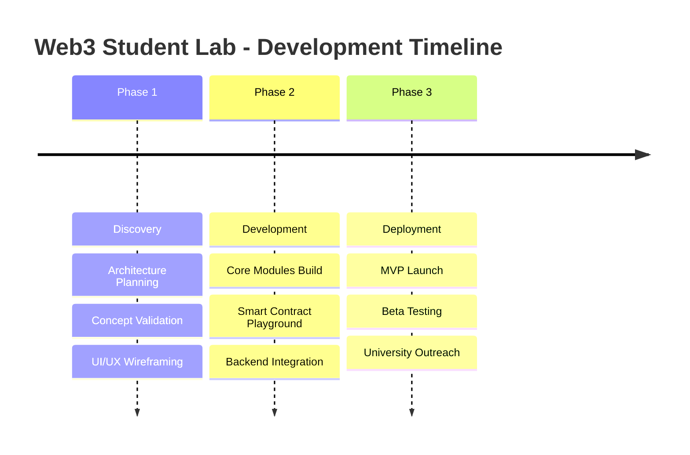

# Web3 Student Lab 🎓⛓️

[](https://opensource.org/licenses/MIT)
[](http://makeapullrequest.com)
[](https://github.com/ellerbrock/open-source-badges/)

**Web3 Student Lab** is an open-source educational platform that helps students learn blockchain,
smart contracts, open-source collaboration, and hackathon project development in one place.

The platform provides **interactive tools, coding environments, and guided learning paths** designed
for beginners and university students.

## � Frequently Asked Questions

- New contributors with environment issues can start here: [docs/FAQ.md](docs/FAQ.md)

## �🚀 Core Modules

1. **Blockchain Learning Simulator**: Visually learn how blockchains work (create transactions, mine
   blocks, view hashes, and see how blocks connect).
2. **Smart Contract Playground**: Write, run, and test smart contracts directly in your browser.
   Focuses on Soroban contracts written in Rust.
3. **Web3 Learning Roadmap**: A guided path spanning programming fundamentals, cryptography,
   blockchain architecture, smart contracts, and full Web3 applications.
4. **Hackathon Project Idea Generator**: Overcome coder's block by generating ideas based on
   technology and sector preferences.
5. **Open Source Contribution Trainer**: Get hands-on with Git, simulated GitHub issues, and PR
   exercises to confidently contribute to open source.

## 🛠 Technology Stack

**Frontend**

- React / Next.js
- Tailwind CSS
- Monaco Editor

**Backend**

- Node.js / Express
- PostgreSQL

**Blockchain Integration**

- Stellar SDK
- Soroban Smart Contracts

## 🗺️ Visual Roadmap & Milestones



### Phase 1: Discovery 🔍

**Objective:** Define the core platform architecture, validate learning mechanisms, and design the
initial curriculum.

- **Milestones:**
  - [x] Initial repository setup and architecture planning
  - [ ] Define Soroban/Stellar learning roadmap
  - [ ] UI/UX wireframes for the Blockchain Simulator

### Phase 2: Development 🛠️

**Objective:** Build out the core modules, integrate blockchain functionalities, and develop the
interactive playground.

- **Milestones:**
  - [ ] Implement Next.js + Tailwind frontend
  - [ ] Integrate Monaco Editor for Smart Contract Playground
  - [ ] Set up PostgreSQL and Node.js backend infrastructure

### Phase 3: Deployment 🚀

**Objective:** Launch the MVP, onboard the first cohort of students, and gather metrics for future
iterations.

- **Milestones:**
  - [ ] Deploy backend and database to cloud infrastructure
  - [ ] Host the frontend application
  - [ ] Open the platform for beta testing

## 📁 Repository Structure

```text
web3-student-lab/
├── contracts/            # Platform smart contracts (e.g., on-chain certificates)
├── frontend/             # Next.js/React frontend application
│   ├── simulator/        # Visual blockchain tools
│   ├── playground/       # In-browser smart contract editor
│   ├── roadmap/          # Learning progress tracking and paths
│   └── ideas/            # Hackathon project generator UI
├── backend/              # Node.js backend application
│   ├── blockchain/       # Interaction with Stellar/Soroban
│   ├── contracts/        # Compilation and execution engine for student code
│   ├── learning/         # Curriculum and progress APIs
│   └── generator/        # Prompt/AI layer for hackathon ideas
└── docs/                 # Documentation and learning materials
```

## 🐳 Getting Started with Docker

The easiest way to set up the local development environment (backend and database) is using Docker
Compose.

### Prerequisites

- [Docker](https://docs.docker.com/get-docker/)
- [Docker Compose](https://docs.docker.com/compose/install/)

### Launching the Environment

1. Clone the repository and navigate to the root directory.
2. Run the following command:
   ```bash
   docker compose up --build
   ```
3. The backend will be available at `http://localhost:8080`.
4. The PostgreSQL database will be accessible at `localhost:5432`.

### Useful Commands

- **Stop the environment**: `docker compose down`
- **View logs**: `docker compose logs -f`
- **Restart a specific service**: `docker compose restart backend`

## 🤝 Rules for Contributors

We love our contributors! This project is being built for students, by students and open-source
enthusiasts.

> **Important:** Please add an ETA (no more than 2 days) when expressing interest in an issue to
> help us keep development moving quickly.

To start contributing:

1. Read our [Contribution Guidelines](CONTRIBUTING.md).
2. Review our [Security Best Practices](docs/SECURITY.md).
3. Read the [CI/CD Pipeline Guide](docs/CICD_GUIDE.md).
4. Check out our existing [Issues](https://github.com/your-repo/issues) or look for the
   `good first issue` label.
5. Fork the repository and submit a Pull Request!

## 📜 License

This project is licensed under the MIT License - see the [LICENSE](LICENSE) file for details.


## Getting Started

This guide will help you set up the Web3 Student Lab locally for development.

---

### Prerequisites

Ensure you have the following installed on your system:

#### Node.js

* Version: 18 or higher (recommended: 20+)
* Download: https://nodejs.org/

Verify installation:

```bash
node -v
npm -v
```

---

#### Rust

* Version: 1.70 or higher
* Install via rustup:

```bash
curl --proto '=https' --tlsv1.2 -sSf https://sh.rustup.rs | sh
```

Restart your terminal, then verify:

```bash
rustc --version
cargo --version
```

---

#### Soroban CLI (Stellar Smart Contracts)

Install the Soroban CLI:

```bash
cargo install --locked soroban-cli
```

Verify installation:

```bash
soroban --version
```

---

#### Docker (Optional but Recommended)

* Required for running backend + database easily
* Install: https://docs.docker.com/get-docker/

Verify:

```bash
docker --version
docker compose version
```

---

### Installation

1. Clone the repository:

```bash
git clone https://github.com/<your-username>/web3-student-lab.git
cd web3-student-lab
```

2. Install frontend and backend dependencies:

```bash
npm install
```

---

### Environment Setup

Create environment configuration files as needed:

```bash
cp .env.example .env
```

Update values depending on your local setup.

---

### Running the Project

#### Option 1: Using Docker (Recommended)

Start backend and database:

```bash
docker compose up --build
```

* Backend: http://localhost:8080
* Database: localhost:5432

---

#### Option 2: Manual Setup

##### Start Backend

```bash
cd backend
npm install
npm run dev
```

##### Start Frontend

```bash
cd frontend
npm install
npm run dev
```

Frontend will run on:

```
http://localhost:3000
```

---

### Smart Contracts (Soroban)

Navigate to the contracts directory:

```bash
cd contracts
```

Build contracts:

```bash
soroban contract build
```

Run tests:

```bash
cargo test
```

(Optional) Deploy to testnet:

```bash
soroban contract deploy \
  --wasm target/wasm32-unknown-unknown/release/<contract-name>.wasm \
  --network testnet
```

---

### Development Tips

* Use Docker for consistent environments
* Run linting and formatting before commits
* Keep dependencies up to date
* Test smart contracts thoroughly before deployment

---

### Troubleshooting

#### Soroban CLI not found

Ensure Cargo bin is in your PATH:

```bash
export PATH="$HOME/.cargo/bin:$PATH"
```

---

#### Rust build issues

Update toolchain:

```bash
rustup update
```

---

#### Port already in use

Kill the process using the port or change the port in your environment config.

---

### Next Steps

* Explore the simulator and playground modules
* Review the documentation in the `docs/` folder
* Start contributing by picking an issue labeled `good first issue`
